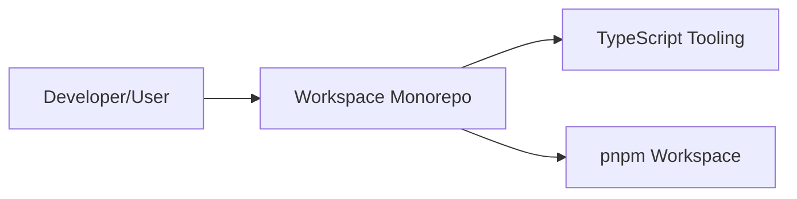

mermaid

<!-- SpecDriven:managed:start -->
<!-- SpecDriven:managed:start -->
# Architecture Guideline

## System Overview
The system is a TypeScript/JavaScript workspace monorepo managed with pnpm and built with TypeScript tooling. It supports modular packages that share tooling and dependencies while enabling isolated development.

References for excluded content:
- Coding conventions: STYLEGUIDE.md
- Testing practices: TESTING.md
- Contribution workflow: CONTRIBUTING.md
- Agent behavior: AGENTS.md

## C4 Diagrams

### Context Diagram
<!-- SpecDriven:managed:end -->
