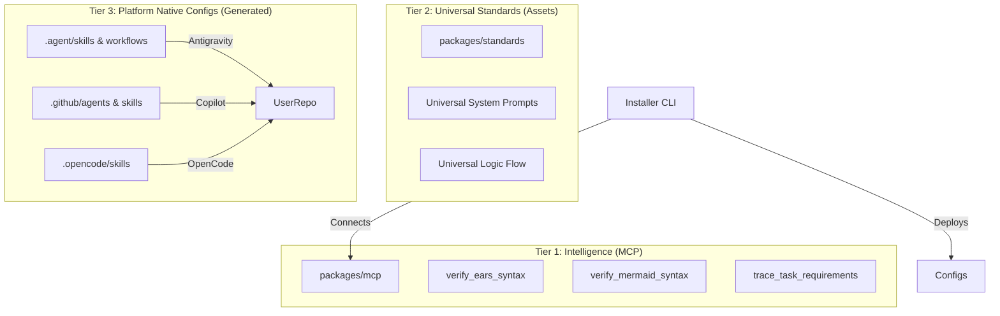

# Product Requirements Document: Spec Driven Asteroids

## 1. Executive Summary

The **Spec Driven Asteroids** project is pivoting from a custom VS Code
Extension "Orchestrator" to a **multi-platform "Spec Driven Asteroids" kit**.

Instead of forcing users into a custom UI, we will provide an installer that
injects **Spec-Driven Intelligence** directly into the AI tools developers
already use: **Google Antigravity**, **GitHub Copilot**, and **OpenCode**.

The core philosophy remains: **Requirements (EARS) → Design (Mermaid) → Tasks →
Code**. The robust validation logic (regex, traceability checks) is preserved
but moved to a **Model Context Protocol (MCP) Server**, ensuring high standards
regardless of the AI engine used.

## 2. Goals & Objectives

- **Frictionless Adoption:** Users enable Spec-Driven capabilities via a single
  CLI command (`npx spec-driven-asteroids inject`), without learning a new UI.
- **Platform Native:** Leverage native features like **Antigravity Workflows**,
  **Copilot Custom Agents**, and **OpenCode Skills**.
- **High Standards Enforcement:** Use an **MCP Server** to act as a rigorous
  "Code Reviewer" for the AI's planning phase, enforcing EARS syntax and
  traceability logic programmatically.
- **Source of Truth:** Centralize logic (`core`) while distributing
  platform-specific adapters (`standards`).

## 3. Architecture

The solution maps to a 3-tier architecture:

### 3.1. Components

1. **`packages/mcp`**: A Node.js MCP Server.
   - Standardized tools for validating specs and diagrams.
   - Logic extracted from current `RequirementsAgent.ts` and `DesignAgent.ts`.
2. **`packages/standards`**: A library of Markdown templates.
   - Contains the "Golden Prompts" for Requirements, Design, and Task planning.
   - Includes adapters to compile these prompts into platform-specific formats
     (Skills vs Agents).
3. **`packages/cli`**: The installer tool (`spec-driven-asteroids`).
   - Detects the user's environment (Antigravity/Copilot/OpenCode).
   - Scaffolds the repository with the correct configuration files.
   - Helps register the MCP server in the user's config.

## 4. Platform Implementation Strategy

### 4.1. Google Antigravity (Strict Structure)

- **Workflows:** Generate `.agent/workflows/spec-feature.md` to define the rigid
  "Requirements → Design → Code" loop.
- **Skills:** Generate `.agent/skills/` folders (e.g., `spec-requirements`)
  containing `SKILL.md` files.
- **Integration:** Relies on Antigravity's native MCP client to call validation
  tools during workflows.

### 4.2. GitHub Copilot (Agentic Personas)

- **Custom Agents:** Generate `.github/agents/` profiles.
  - `@spec-planner`: Specialized in EARS gathering and validation.
  - `@spec-designer`: Specialized in Mermaid architecture.
- **Skills:** Generate `.github/skills/` for reusable capabilities.
- **Instructions:** Update `.github/copilot-instructions.md` to guide the
  default `@copilot` agent to respect the artifacts created by the custom
  agents.

### 4.3. OpenCode (Configurable)

- **Agents:** Update `opencode.json` to define Primary or Subagents with
  specific prompt contexts.
- **Skills:** Generate `.opencode/skills/` compatible with the progressive
  disclosure model.
- **MCP:** Configure via OpenCode's MCP plugin architecture.

## 5. Functional Requirements (MCP Tools)

The **MCP Server** acts as the quality gate. It must expose the following tools:

| Tool Name                   | Input                             | Logic                                                                  | Output                                 |
| :-------------------------- | :-------------------------------- | :--------------------------------------------------------------------- | :------------------------------------- |
| **`verify_ears_syntax`**    | `content` (string)                | Checks for EARS keywords (WHEN, IF, THEN, SHALL). Enforces formatting. | Valid: true/false + Error Messages     |
| **`verify_mermaid_syntax`** | `content` (string)                | Validates Mermaid graph syntax.                                        | Valid: true/false + Render Preview URL |
| **`trace_requirements`**    | `tasks` (json), `reqs` (markdown) | Checks if every task links to a valid Requirement ID.                  | Coverage Report + Missing Links        |
| **`scaffold_spec_file`**    | `type` (req/design)               | Returns the standard Markdown template for that document type.         | Template Content                       |

## 6. Migration & Refactoring Plan

### Phase 1: Logic Extraction (The MCP Layer)

- [x] Create `packages/mcp`.
- [x] Extract `EarsStrategy` and regex logic from `packages/core`.
- [x] Implement `verify_ears_syntax` MCP tool.
- [x] Extract Mermaid validation logic.
- [x] Implement `verify_mermaid_syntax` MCP tool.

### Phase 2: Standards Definition (Intelligence as Code)

- [x] Create `packages/standards`.
- [x] **Port `GuidelinesGenerator` logic to `spec-guidelines-writer`
      SKILL/Agent.**
- [x] Create `templates/antigravity/` (Workflows/SKILLS).
- [x] Create `templates/github/` (Agents/Instructions).
- [x] Create `templates/opencode/` (Skills).
- [x] Consolidate all system prompts into a "Universal Prompt" strategy to reuse
      across templates.

### Phase 3: CLI & Installer

- [x] Create `packages/cli`.
- [x] Implement `inject` command with interactive platform selection.
- [x] Implement file copying logic (Templates -> User Repo).
- [x] Add `validate` command to check if user config is correct.

### Phase 4: Deprecation

- [x] Deprecate `packages/adapters/inbound/vscode` (The extension).
- [x] Deprecate `packages/core` (Orchestrator logic moved to MCP/CLI).
- [x] Clean up `pnpm-workspace.yaml` and root `README.md`.

## 7. Success Metrics

- **Adoption Time:** User can go from `npm install` to running a Spec-Driven
  Plan in < 2 minutes.
- **Platform Coverage:** Fully functional in Antigravity, Copilot, and OpenCode.
- **Defect Prevention:** MCP validator successfully catches malformed EARS
  syntax in >90% of test cases.
