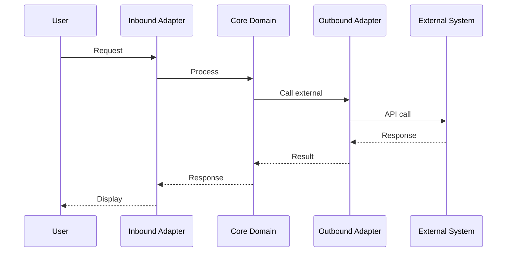

# Architecture

This document describes the system architecture using visual diagrams.

> **Note**: For tech stack details, see [AGENTS.md](AGENTS.md). For coding conventions, see [STYLEGUIDE.md](STYLEGUIDE.md).

<!-- SpecDriven:managed:start -->

## System Overview

{{ARCHITECTURE_OVERVIEW}}

## System Context

Shows how this system fits into its environment with external systems and users.

```mermaid
graph TD
    User[User] --> System[{{SYSTEM_DESCRIPTION}}]
    System --> ExtSystem[{{EXT_SYSTEM_1_DESC}}]
```

## High-Level Architecture

Shows the high-level technical building blocks of the system.

```mermaid
graph TD
    subgraph System
        Core[Core - {{CORE_TECH}}]
        Adapters[Adapters - {{ADAPTERS_TECH}}]
    end

    User[User] --> Adapters
    Adapters --> Core
```

## Component Structure

Shows the internal structure of key components.

```mermaid
graph TD
    subgraph Core
        Domain[Domain - {{DOMAIN_TECH}}]
        Services[Services - {{SERVICE_TECH}}]
        Ports[Ports - {{PORTS_TECH}}]
    end

    Services --> Domain
    Services --> Ports
```

## Data Flow

### Primary Flow



## Module Boundaries

| Package | Responsibility | Dependencies |
|---------|---------------|--------------|
{{PACKAGE_BOUNDARIES}}

## Architecture Decision Records (ADRs)

### ADR Template

When making significant architectural decisions, document them using this format:

| Field | Description |
|-------|-------------|
| **Title** | Short descriptive title |
| **Status** | Proposed / Accepted / Deprecated / Superseded |
| **Context** | What is the issue we're seeing that motivates this decision? |
| **Decision** | What is the change we're proposing? |
| **Consequences** | What becomes easier or harder because of this change? |

### Recorded Decisions

{{ADRS}}

<!-- SpecDriven:managed:end -->

## Additional Architecture Notes

<!-- Add any project-specific architecture notes below this line -->
