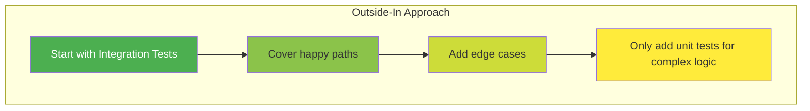
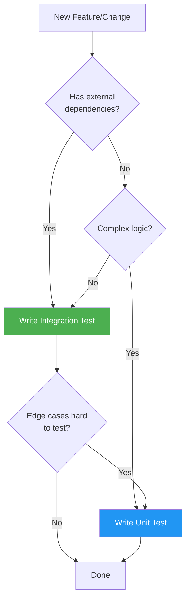

# Testing Strategy

This document defines the testing approach for this project using an **Outside-In** testing strategy.

> **Note**: For code style, see [STYLEGUIDE.md](STYLEGUIDE.md). For Git workflow, see [CONTRIBUTING.md](CONTRIBUTING.md).

<!-- SpecDriven:managed:start -->

## Philosophy: Outside-In Testing

We prioritize **integration tests over unit tests** to:
- Test behavior, not implementation details
- Reduce test maintenance when refactoring
- Catch real bugs that unit tests miss
- Minimize mocking complexity



## Test Pyramid

| Type | Percentage | Purpose | When to Write |
|------|------------|---------|---------------|
| **Integration** | 60% | Validate real component interaction | Always start here |
| **Unit** | 25% | Complex algorithms, edge cases | Only when integration tests are insufficient |
| **E2E** | 15% | Critical user journeys | Smoke tests, key flows |

## When to Write Each Type

### Write Integration Tests When:

- Testing API endpoints
- Testing database operations
- Testing service-to-service communication
- Testing complete feature workflows

### Write Unit Tests Only When:

- Testing pure functions with complex logic
- Testing edge cases hard to trigger via integration
- Testing mathematical calculations
- The function has no external dependencies

### Write E2E Tests When:

- Testing critical user journeys
- Testing complex UI interactions
- Smoke testing after deployments

## Test Decision Tree



## Frameworks & Tools

{{TEST_FRAMEWORKS}}

## Test Organization

### File Structure

```
src/
├── features/
│   └── users/
│       ├── users.service.ts
│       └── users.service.test.ts      # Co-located tests
tests/
├── integration/                        # Integration tests
└── e2e/                               # End-to-end tests
```

### Naming Conventions

- Test files: `*.test.ts` or `*.spec.ts`
- Test descriptions: `should [expected behavior] when [condition]`

## Mocking Rules

| Scenario | Mock? | Why |
|----------|-------|-----|
| Database | No | Use test database or testcontainers |
| External APIs | Yes | Use contract tests + mocks |
| Time/Date | Yes | Use clock mocking for determinism |
| Internal services | No | Test real integration |

## Coverage Expectations

| Metric | Target | Notes |
|--------|--------|-------|
| Line Coverage | {{LINE_COVERAGE}} | Focus on critical paths |
| Branch Coverage | {{BRANCH_COVERAGE}} | Cover error branches |
| Integration Ratio | 60%+ | Of total test count |

## Running Tests

```bash
# Run all tests
{{RUN_ALL_TESTS}}

# Run integration tests
{{RUN_INTEGRATION_TESTS}}

# Run unit tests
{{RUN_UNIT_TESTS}}

# Run with coverage
{{RUN_WITH_COVERAGE}}
```

<!-- SpecDriven:managed:end -->

## Project-Specific Testing Notes

<!-- Add any project-specific testing guidelines below this line -->
