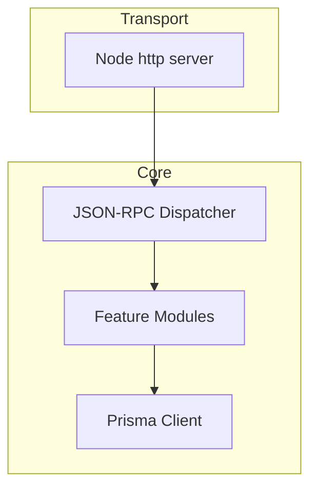
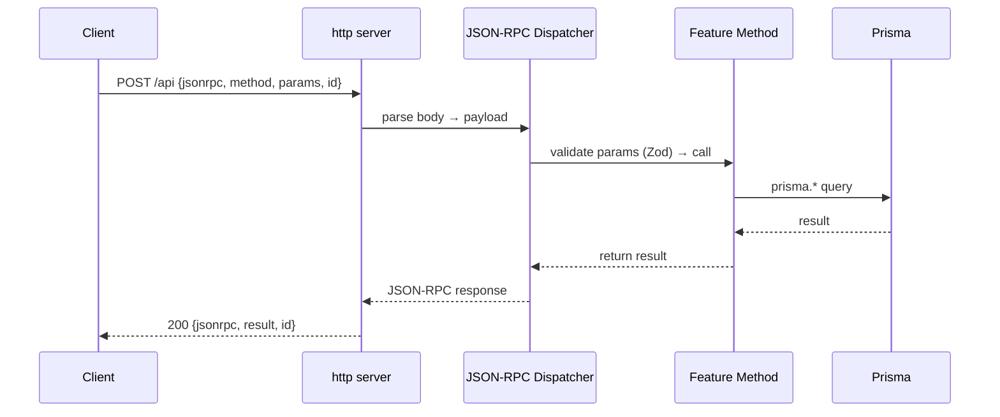
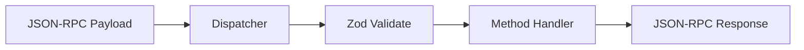
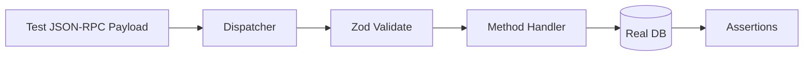

# Default Architecture Guide

When architecture guidance is not specified, use these opinionated defaults.
**User-defined values ALWAYS override these defaults.** Only use defaults to fill gaps.

## 1. Architecture Overview

**Style**: No‑framework JSON‑RPC microservice with vertical slices.

**Core Principle**: The transport layer is thin; the dispatcher is pure.



## 2. Request Lifecycle



## 3. Module Boundary Rules

- Each module owns its schemas, methods, and tests.
- No cross‑module access to internal functions.
- Shared utilities go in `lib/` only when truly reusable.

## 4. Dispatcher Contract (Central Brain)

- `dispatch(payload)` is a pure function.
- Must not depend on HTTP `req`/`res`.
- Auto‑handles Zod validation: failures return **-32602 Invalid params**.
- Unknown method returns **-32601 Method not found**.

### 4.1 Method Map

- Maintain a `MethodMap` of `"feature.method" -> handler`.
- Adding a feature = add schema + handler + MethodMap entry.



## 5. JSON‑RPC 2.0 Strictness

**Success**:

```json
{ "jsonrpc": "2.0", "result": { ... }, "id": 1 }
```

**Error**:

```json
{ "jsonrpc": "2.0", "error": { "code": -32600, "message": "Invalid Request" }, "id": null }
```

## 6. Vertical Slice Layout

```
src/
├── modules/
│   ├── health/
│   │   ├── health.methods.ts
│   │   ├── health.schema.ts
│   │   └── health.test.ts
│   ├── user/
│   │   ├── user.methods.ts
│   │   ├── user.schema.ts
│   │   └── user.test.ts
├── lib/
│   ├── prisma.ts
│   ├── rpc-server.ts
│   └── http-entry.ts
├── main.ts
└── schema.prisma
```

## 7. Infrastructure Decisions

- **HTTP server**: native `node:http` only.
- **Env**: `process.loadEnvFile()` reads `.env` / `.env.example`.
- **Database**: Prisma with SQLite for local, Postgres for CI.

## 8. Testing Topology

- Outside‑in integration tests call the dispatcher with real JSON‑RPC payloads.
- Assert both JSON‑RPC response **and** database state.
- No Prisma mocking; use real DB (SQLite local, Postgres CI).



## 9. Non‑Goals

- Framework routing
- Magic middleware chains
- Implicit dependency injection
- Reflection-based discovery
